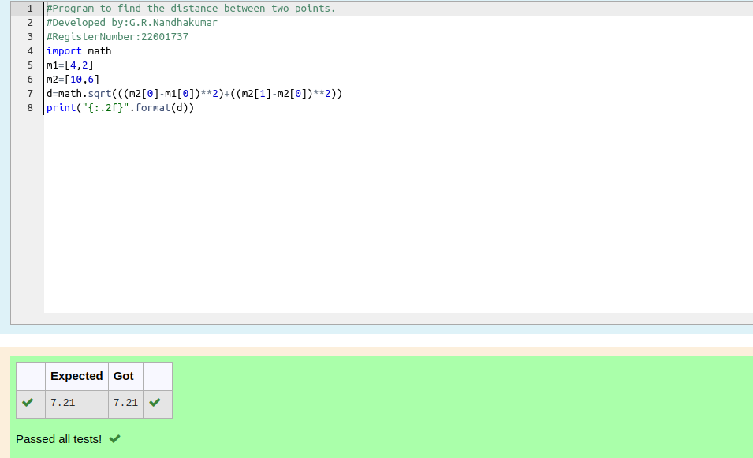

# DISTANCE-BETWEEN-TWO-POINTS

## AIM:

To write a python program to find the distance two 2 points

## ALGORITHM:

### Step 1: 

Import math 

### Step 2: 

initialize the  two values

### Step 3: 

Substitute the values in the distance formula  

### Step 4: 

Print the values in .format

### Step 5: 

End the program


### PROGRAM:#Program to find the distance between two points.
```python
#Developed by:G.R.Nandhakumar 
#RegisterNumber:22001737
import math
m1=[4,2]
m2=[10,6]
d=math.sqrt(((m2[0]-m1[0])**2)+((m2[1]-m2[0])**2))
print("{:.2f}".format(d))
```

  
### OUTPUT:



### RESULT:

The distance betwwen two values are successfully executed